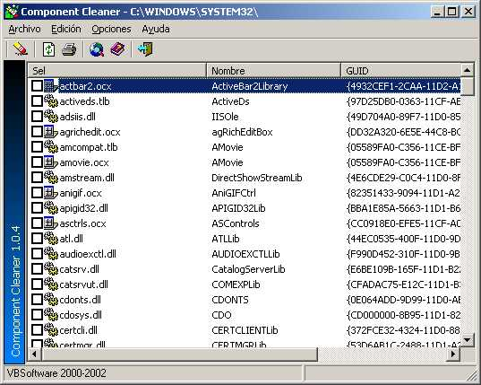



## Component Cleaner

### Description

This app clean the registry entries the activex files (dll,ocx,exe activex). You must configure the path where lives the activex files and go to clean the registry.
 
### More Info
 

             |
---                |---
**Submitted On**   |2002-04-18 22:57:36
**By**             |[Leo Nunez](https://github.com/Planet-Source-Code/PSCIndex/blob/master/ByAuthor/leo-nunez.md)
**Level**          |Advanced
**User Rating**    |5.0 (10 globes from 2 users)
**Compatibility**  |VB 4\.0 \(32\-bit\), VB 5\.0, VB 6\.0
**Category**       |[Complete Applications](https://github.com/Planet-Source-Code/PSCIndex/blob/master/ByCategory/complete-applications__1-27.md)
**World**          |[Visual Basic](https://github.com/Planet-Source-Code/PSCIndex/blob/master/ByWorld/visual-basic.md)
**Archive File**   |[Component\_16876212292003\.zip](https://github.com/Planet-Source-Code/leo-nunez-component-cleaner__1-50647/archive/master.zip)

